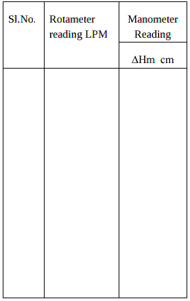
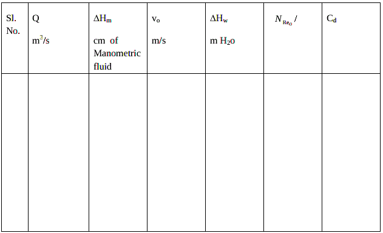

#### Apparatus required :

CCL4 manometer, Hg manometer.

#### Procedure :
<ul style="text-align: justify; list-style-type: circle;">
 <li>Keep the bypass valve completely open and the main valve completely closed. Switch on
the pump.</li>
 <li>Connect a CCL4 manometer across the orifice.</li>
 <li>Open the main valve and set a flow rate of water using the Rotameter.</li>
 <li>Note down the Rotameter reading and manometer reading after a steady state is attained.</li>
 <li>Increase the flow rate by opening the main valve and throttling the bypass valve suitably
and repeat step 4.</li>
 <li>Use mercury manometer for higher flow rates.</li>
 <li> Take readings withCCL4 manometer as well as with Hg manometer.</li>
 <li>Repeat the experiment with different  ratios and with different fluids.</li>
 </ul>

#### Data :

Diameter of the pipe = d =&nbsp;&nbsp;&nbsp;&nbsp;&nbsp;&nbsp;&nbsp;&nbsp;&nbsp;&nbsp;cm 
Diameter of the orifice = d0=&nbsp;&nbsp;&nbsp;&nbsp;&nbsp;&nbsp;&nbsp;&nbsp;&nbsp;&nbsp; cm 
Density of CCl4 =CCL4  =&nbsp;&nbsp;&nbsp;&nbsp;&nbsp;&nbsp;&nbsp;&nbsp;&nbsp;&nbsp; &nbsp;&nbsp;&nbsp;&nbsp;&nbsp;kg/m3 
Density of Hg =Hg  = &nbsp;&nbsp;&nbsp;&nbsp;&nbsp;&nbsp;&nbsp;&nbsp;&nbsp;&nbsp;kg/m3 
Density of fluid =  = &nbsp;&nbsp;&nbsp;&nbsp;&nbsp;&nbsp;&nbsp;&nbsp;&nbsp;&nbsp;kg/m3 

Viscosity of fluid=   = kg/m3 =&nbsp;&nbsp;&nbsp;&nbsp;&nbsp;&nbsp;&nbsp;&nbsp;&nbsp;&nbsp;cp 

#### Observations :

Hg  = kg/m3

 

#### Calculations :
Flow rate: 

∆Hm = cm of manometric fluid. 
Volumetric flow rate = Q = m3/s 

 =&nbsp;&nbsp; &nbsp;m of H2o 
=density of manometric fluid. 
Average velocity through the orifice = =&nbsp;&nbsp;&nbsp; m/s 
A0 = cross sectional areaof orifice =&nbsp; 

Reynolds Number at the orifice =  =  

=  

Coefficient of discharge = Cd =   

  
Plot Q vs  and Q vs  on ordinary graph(calibration). 

Plot Cd vs NReo on a semilog graph sheet (with NReoon log scale). 

Plot log Q vs log 
.Find the slope and the intercept. Find the coefficient and power of
. Comment on the nonlinear flow head relationship. Obtain Cd from the plot.
##### Results :
<ul>
<li>Report on calibration</li>
<li>Comment on Cd vs NReo</li>
<li>Report the Cd</li>
<li>Comment on flow head relationship</li>
</ul>
